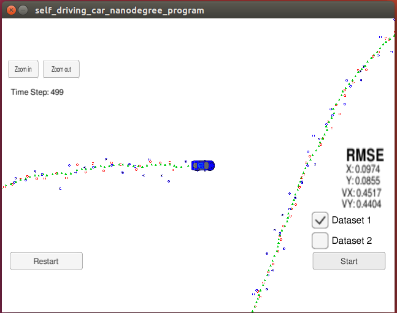

# Extended Kalman Filter Project Starter Code
Self-Driving Car Engineer Nanodegree Program

In this project a Extended Kalman Filter is implemented to esitmate the position and velocity of a bicycle that travel around a simulated car. The performance of EKF is evaluated by Root Mean Squared Error(RMSE).

In the picture, lidar measurements are red circles, radar measurements are blue circles with an arrow pointing in the direction of the observed angle, and estimation markers are green triangles.

### File Structure
In `src`:
* `Eigen` is a library to support matrix computation.
* `FusionEKF.cpp` is the code to implement sensor fusion logic.
* `kalman_filter.cpp` defines the Kalman Filter for Laser measurement and Extended Kalman Filter for Radar measurement.
* `main.cpp` is the code to send messages to the simulator.
* `tool.cpp` is the code to compute RMSE and Jacobian of the H matrix in EKF.
### Dependencies
* This project involve using an open source package called uWedSocketIO. You can install it on linux by `./install-ubuntu.sh` in this project folder.
* You need this [simulator](https://github.com/udacity/self-driving-car-sim/releases/). After open it, select the EKF/UKF simulation. 